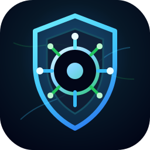

<p align="center">
  
</p>

<h1 align="center">Jarvis Cyber</h1>

<p align="center">
  A secure AI-powered cybersecurity copilot for SOC operations, investigation workflows, and analyst productivity.
</p>

<p align="center">
  <strong>FastAPI</strong> · <strong>Local-first</strong> · <strong>SOC workflows</strong> · <strong>Microsoft security integrations</strong> · <strong>Human approval guardrails</strong>
</p>

---

## Overview

Jarvis Cyber is a local-first cybersecurity assistant designed to behave like a capable SOC colleague: it helps analysts triage alerts, enrich investigations, organize evidence, draft reports, prioritize active cases, and prepare shift handovers.

The project is built around one core principle:

> Jarvis can recommend, organize, enrich, and draft — but sensitive actions stay explicit, visible, and analyst-controlled.

It is intended for defensive security work, SOC operations, incident response preparation, vulnerability analysis, and investigation management.

---

## Key Capabilities

### AI Cyber Assistant

- Chat-oriented analyst assistant
- Local fallback behavior when remote models are unavailable
- Structured cyber workflows for triage, CVE analysis, and reporting
- Knowledge-aware answers with internal document citations
- Voice and realtime interaction scaffolding

### Investigation Case Management

- Persistent investigation dossiers
- Checklist tracking
- Analyst notes
- Timeline events
- Evidence tracking
- Hypothesis management
- Progress summaries
- Final incident report drafting

### SOC Operations Layer

- SOC case queue with explainable prioritization
- Shift brief mode for operational handover
- SLA / aging timers for active cases
- Incident-specific cockpit views
- Closure assistant with readiness scoring

### Enrichment Workflows

- Microsoft Entra ID enrichment
- Microsoft Defender / Graph Security enrichment
- Microsoft Sentinel / Log Analytics KQL enrichment
- Sentinel KQL query packs and templates
- Advisory enrichment plans based on case type
- Form prefill from recommendations without automatic execution

### Security and Governance

- Authentication and role-based access control
- MFA support
- Session management
- Security audit events
- Secret vault support
- Human approval workflows
- Tool guardrails for sensitive operations
- Read-only connector design by default

---

## Supported Connectors

Jarvis Cyber currently includes read-oriented integrations for:

- GitHub
- Google Drive
- Jira
- NVD CVE API
- Microsoft Entra ID
- Microsoft Defender / Microsoft Graph Security
- Microsoft Sentinel / Azure Monitor Log Analytics

Connector secrets can be supplied through environment variables or the internal secret-management layer.

---

## Architecture

```text
Jarvis Cyber
├── FastAPI backend
├── Web UI
├── SQLite local persistence
├── Auth / MFA / RBAC / audit
├── Knowledge and memory services
├── Cyber workflow services
├── Connector integrations
├── SOC investigation services
└── Tests and documentation
```

Main source tree:

```text
src/jarvis_cyber/
├── api/                    # FastAPI application and HTTP endpoints
├── core/                   # Shared schemas and prompts
├── services/               # Application logic and workflow orchestration
├── integrations/           # External connector clients
├── investigations/         # Persistent investigation cases
├── investigation_profiles/ # Investigation templates and profiles
├── knowledge/              # Document storage, extraction, embeddings
├── approvals/              # Human approval store
├── automations/            # Scheduled routines
├── storage/                # SQLite database helper
└── web/                    # Local web interface and static assets
```

---

## Quickstart

### Windows automatic start

Double-click `start.bat`, or run:

```bat
start.bat
```

The script creates `.venv`, installs the project and development dependencies,
creates `.env` from `.env.example`, checks the main Python imports, and starts
Jarvis on `http://127.0.0.1:8000`.

Voice, transcription, text-to-speech, embeddings, and Realtime require a valid
`OPENAI_API_KEY` in `.env`. The startup script displays a warning when this key
is missing.

### 1. Clone the repository

```bash
git clone https://github.com/servais1983/Jarvis2.0.git
cd Jarvis2.0
```

### 2. Create a virtual environment

```bash
python -m venv .venv
```

Windows PowerShell:

```powershell
.\.venv\Scripts\Activate.ps1
```

macOS / Linux:

```bash
source .venv/bin/activate
```

### 3. Install dependencies

```bash
pip install -e ".[dev]"
```

### 4. Configure environment variables

```bash
cp .env.example .env
```

Then edit `.env` and provide only the services you want to enable.

For local development, Jarvis can run without external connector tokens.

### 5. Run the application

```bash
uvicorn jarvis_cyber.api.main:app --host 127.0.0.1 --port 8000
```

Open:

```text
http://127.0.0.1:8000
```

---

## Configuration

Important environment variables include:

```env
JARVIS_ENV=development
JARVIS_AUTH_REQUIRED=false
JARVIS_DATABASE_PATH=./data/jarvis.db
JARVIS_MAIN_MODEL=gpt-5.4
JARVIS_FAST_MODEL=gpt-5.4-mini
JARVIS_REALTIME_MODEL=gpt-realtime-mini
OPENAI_API_KEY=
```

Security-related settings:

```env
JARVIS_AUTH_REQUIRED=true
JARVIS_SECRET_VAULT_KEY=
JARVIS_MFA_ENCRYPTION_KEY=
JARVIS_HSTS_ENABLED=true
```

Connector examples:

```env
JARVIS_GITHUB_TOKEN=
JARVIS_GOOGLE_DRIVE_ACCESS_TOKEN=
JARVIS_JIRA_BASE_URL=
JARVIS_JIRA_EMAIL=
JARVIS_JIRA_API_TOKEN=
JARVIS_ENTRA_ID_ACCESS_TOKEN=
JARVIS_DEFENDER_ACCESS_TOKEN=
JARVIS_SENTINEL_WORKSPACE_ID=
JARVIS_SENTINEL_ACCESS_TOKEN=
```

Never commit `.env`, database files, screenshots, or local artifacts. The repository `.gitignore` excludes these by default.

---

## API Highlights

### Health

```http
GET /health
```

### Chat

```http
POST /chat
```

### CVE Workflow

```http
POST /workflows/cve-enrichment
```

### Alert Investigation

```http
POST /workflows/alert-investigation
```

### Investigation Cases

```http
POST /investigation-cases
GET /investigation-cases
GET /investigation-cases/{case_id}
PATCH /investigation-cases/{case_id}/status
POST /investigation-cases/{case_id}/summary
POST /investigation-cases/{case_id}/report
```

### SOC Operations

```http
GET /investigation-cases/queue
GET /investigation-cases/shift-brief
GET /investigation-cases/sla
POST /investigation-cases/{case_id}/incident-view
POST /investigation-cases/{case_id}/closure-assistant
POST /investigation-cases/{case_id}/enrichment-plan
```

### Connector Enrichment

```http
POST /investigation-cases/{case_id}/enrich/entra-id
POST /investigation-cases/{case_id}/enrich/defender
POST /investigation-cases/{case_id}/enrich/sentinel
```

### Sentinel Query Packs

```http
GET /sentinel-query-templates
POST /sentinel-query-templates/{template_id}/render
```

---

## SOC Workflow Model

Jarvis Cyber supports a full investigation lifecycle:

1. Triage the alert
2. Create or continue a persistent case
3. Apply an investigation profile
4. Track checklist progress
5. Add notes, timeline events, evidence, and hypotheses
6. Request connector-based enrichment
7. Review incident-specific cockpit views
8. Prioritize work through the SOC queue
9. Generate a shift brief
10. Monitor SLA / aging timers
11. Use the closure assistant
12. Draft the final incident report

Jarvis separates facts from hypotheses and avoids silently turning enrichment results into conclusions.

---

## Security Model

Jarvis Cyber is designed with defensive workflows and controlled automation in mind.

Security principles:

- Read-only connector defaults
- Explicit analyst action for sensitive enrichment
- Human approval gates for sensitive tools
- No automatic case closure
- No automatic external queries from advisory plans
- Local persistence by default
- Secrets excluded from Git
- MFA and RBAC available for protected deployments
- Audit trail for security-relevant actions

Recommended production posture:

- Enable authentication: `JARVIS_AUTH_REQUIRED=true`
- Set strong vault and MFA encryption keys
- Serve behind HTTPS
- Enable HSTS
- Restrict connector scopes to least privilege
- Use dedicated service accounts where applicable
- Review logs and audit events regularly

---

## Testing

Run the full test suite:

```bash
python -m pytest -q
```

Run linting:

```bash
ruff check .
```

Current local validation status at the time of this README update:

```text
148 tests passing
ruff clean
```

---

## Development Notes

The application is intentionally local-first. SQLite is used for durable local persistence, and external integrations are optional. This makes the project suitable for iterative development, demos, controlled SOC labs, and later hardening toward production.

Generated or local-only files are intentionally ignored:

```text
.venv/
.env
data/
artifacts/
.pytest_cache/
.ruff_cache/
__pycache__/
```

---

## Roadmap

Potential next steps:

- Production deployment profile
- GitHub Actions CI
- Docker packaging
- Advanced case assignment and ownership
- More SIEM / EDR connectors
- Exportable incident report documents
- Notification integrations
- Fine-grained approval policies
- Expanded voice-first SOC workflow

---

## Responsible Use

Jarvis Cyber is intended for authorized defensive cybersecurity work only. Do not use this project to access systems, data, or services without permission. Always follow your organization’s security policies, legal obligations, and incident response procedures.

---

## License

No license has been declared yet. Add a license before distributing or using this project outside your own environment.
