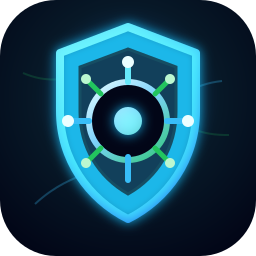

<p align="center">
  
</p>

<h1 align="center">Jarvis Cyber</h1>

<p align="center">
  A secure AI-powered cybersecurity copilot for SOC operations — with a built-in local voice assistant for your PC.
</p>

<p align="center">
  <strong>FastAPI</strong> · <strong>Local-first</strong> · <strong>SOC workflows</strong> · <strong>Ollama (LLM local)</strong> · <strong>Assistant vocal</strong> · <strong>Microsoft security integrations</strong>
</p>

---

## Overview

Jarvis Cyber est un assistant IA local conçu sur deux piliers :

**1. Copilot cybersécurité (SOC)**
Assistant SOC complet : triage d'alertes, enrichissement d'investigations, organisation des preuves, rédaction de rapports, priorisation des cas, et handover de shift.

> Jarvis can recommend, organize, enrich, and draft — but sensitive actions stay explicit, visible, and analyst-controlled.

**2. Assistant vocal local pour PC**
Un vrai Jarvis à la Iron Man : réveil par mot-clé, reconnaissance vocale, LLM local via Ollama (fonctionne sans internet), synthèse vocale hors-ligne, et commandes PC (navigateur, YouTube, recherche Google, applications...).

> Dites "Jarvis" — il écoute, comprend, répond, et agit.

---

---

## Assistant Vocal Local — Jarvis pour votre PC

### Démarrage rapide (Windows)

```bat
start_vocal.bat
```

### Démarrage rapide (Linux / macOS)

```bash
./start_vocal.sh
```

> Les scripts créent automatiquement le `.venv`, installent les dépendances vocales, et lancent Jarvis.

### Prérequis

1. **Ollama** — moteur LLM local (fonctionne sans internet) :
   - Télécharger : https://ollama.com
   - Télécharger un modèle : `ollama pull deepseek-r1`
   - Laisser Ollama tourner en arrière-plan pendant l'utilisation

2. **PyAudio** — accès au microphone :
   - Windows : `pip install pyaudio` (ou `pipwin install pyaudio` si problème)
   - Ubuntu/Debian : `sudo apt install portaudio19-dev` puis `pip install pyaudio`
   - macOS : `brew install portaudio` puis `pip install pyaudio`

3. **Connexion internet pour la reconnaissance vocale** (Google Speech Recognition)

### Installation manuelle

```bash
pip install -e ".[voice]"
python jarvis_vocal.py
```

### Fonctionnalités vocales

| Fonctionnalité | Détail |
|---|---|
| **Wake word** | Dites "Jarvis..." pour activer |
| **Arrêt vocal** | "arrête", "tais-toi", "silence", "stop" |
| **Reconnaissance vocale** | Google Speech Recognition (fr-FR) |
| **LLM local** | Ollama — deepseek-r1 / llama3 / mistral (configurable) |
| **Fallback** | OpenAI si Ollama n'est pas lancé |
| **Synthèse vocale** | pyttsx3 — fonctionne 100% hors-ligne |
| **Mémoire** | Historique conversation, reset après 3 min d'inactivité |
| **Threading** | Jarvis parle sans bloquer l'écoute microphone |
| **Commandes PC** | Voir tableau ci-dessous |

### Commandes PC reconnues

| Ce que vous dites | Action |
|---|---|
| "Jarvis, recherche [sujet]" | Ouvre Google avec la recherche |
| "Jarvis, cherche [sujet] sur YouTube" | Lance une recherche YouTube |
| "Jarvis, ouvre le navigateur" | Ouvre le navigateur par défaut |
| "Jarvis, ouvre le gestionnaire de fichiers" | Ouvre l'explorateur de fichiers |
| "Jarvis, ouvre le bloc-notes" | Ouvre l'éditeur de texte |
| "Jarvis, ouvre la calculatrice" | Ouvre la calculatrice |
| "Jarvis, météo" | Affiche la météo du jour (Google) |
| "Jarvis, ouvre Spotify" | Ouvre Spotify |
| "Jarvis, [n'importe quelle question]" | Répond via le LLM local |

### Configuration assistant vocal

Variables d'environnement (dans `.env`) :

```env
OLLAMA_URL=http://localhost:11434/api/generate
OLLAMA_MODEL=deepseek-r1
JARVIS_WAKE_WORD=jarvis
JARVIS_USER_NAME=Steve
JARVIS_LANG=fr-FR
JARVIS_SPEECH_RATE=170
```

Pour changer de modèle Ollama (exemples) :
```bash
ollama pull llama3
ollama pull mistral
# puis dans .env : OLLAMA_MODEL=llama3
```

---

---

## Interface — Neural Command Center (Dark Knight edition)

### Démarrage en une commande

```bat
start.bat        &:: Windows
```
```bash
./start.sh       # Linux / macOS
```

Le script fait tout : environnement virtuel, dépendances (serveur + MCP), création de `.env` et `mcp_servers.json` s'ils manquent, démarrage d'Ollama en arrière-plan s'il est installé, lancement du serveur et ouverture du navigateur sur l'interface. Il ne reste qu'à **cliquer sur l'orb et parler**.

L'interface web est un centre de commande plein écran, noir profond façon DC Comics — bleu acier et or sur fond gothique :

**On parle directement à l'orb** — pas de chat séparé : un champ « Parle à Jarvis… » et un micro sous la sphère, Jarvis répond à voix haute (synthèse vocale du navigateur) avec sous-titres sous l'orb, et exécute réellement les actions demandées.

| Élément | Description |
|---|---|
| **Orb conversationnel** | Sphère de ~600 particules bleu acier + anneau doré ; on lui écrit ou on lui parle, il répond en voix + sous-titres |
| **Reconnaissance vocale** | Micro à gauche du champ : écoute continue fr-FR (Web Speech API), interruption de Jarvis à la voix (« stop », « tais-toi ») |
| **Intentions comprises** | « ouvre les dossiers », « analyse CVE-2021-44228 », « brief de quart », « brief du jour », « contrôle les SLA », « file de travail », « rapport de situation », « combien de dossiers / playbooks / approbations… », « quelle heure est-il », « présente-toi », « nouvelle session » — le reste part au LLM local |
| **Actions réelles** | Les intentions déclenchent les vrais workflows (formulaires préremplis + soumis) et Jarvis lit le résultat à voix haute |
| **Réseau d'agents** | 14 nœuds cliquables reliés à l'orb par des lignes de circuit, avec badges dorés temps réel (dossiers ouverts, approbations, inbox, documents, playbooks, watchlists, connecteurs) |
| **Console** | Bouton ⌸ CONSOLE : transcription complète de la conversation + contrôles vocaux avancés — les réponses y sont aussi lues par l'orb |
| **Fond neuronal** | Constellation de particules animées reliées entre elles, plein écran |
| **Waveform** | Barres audio temps réel (Web Audio API) sous le champ de saisie |
| **4 états visuels** | Veille (bleu/or) · Écoute (vert) · Traitement (ambre) · Réponse (bleu glacé) |
| **Cluster de statut** | Horloge, date, accueil personnalisé — « Bonsoir, Steve. » (prénom via `JARVIS_USER_NAME`, remplacé par le nom du profil s'il est renseigné), éphéméride cyber, état système |
| **Mobile** | Orb plein écran + grille de modules avec badges, dock fixé en bas |

Fichiers de l'interface :
- `src/jarvis_cyber/web/index.html` — scène centrale + fenêtres HUD des modules
- `src/jarvis_cyber/web/static/styles.css` — thème neural command center complet
- `src/jarvis_cyber/web/static/jarvis-fx.js` — orb à particules, réseau d'agents, waveform, fenêtres, horloge

---

## Serveurs MCP — donner de nouveaux outils à Jarvis

Jarvis peut se connecter à des serveurs **MCP (Model Context Protocol)** et utiliser leurs outils depuis l'orb ou la fenêtre « Outils MCP » (nœud doré en bas à droite, avec badge du nombre d'outils).

### Installation

```bash
pip install -e ".[mcp]"
cp mcp_servers.json.example mcp_servers.json   # puis adapte-le
```

### Configuration (`mcp_servers.json`, format compatible Claude Desktop)

```json
{
  "mcpServers": {
    "demo": {
      "command": "python",
      "args": ["examples/mcp_demo_server.py"],
      "enabled": true
    },
    "filesystem": {
      "command": "npx",
      "args": ["-y", "@modelcontextprotocol/server-filesystem", "/chemin/vers/dossier"],
      "enabled": false
    }
  }
}
```

Un serveur de démonstration est fourni (`examples/mcp_demo_server.py`) avec trois outils : `heure_locale`, `calcul`, `infos_systeme`.

### Utilisation depuis l'orb

| Ce que tu dis / écris | Ce que fait Jarvis |
|---|---|
| « quels outils as-tu ? » | Liste les outils MCP disponibles et ouvre la fenêtre |
| « calcule (12+8)*3 » | Appelle l'outil `calcul` d'un serveur MCP et lit le résultat |
| « utilise l'outil infos_systeme » | Exécute l'outil nommé (argument texte libre ou JSON) |
| « ouvre les outils » | Ouvre la fenêtre Outils MCP (serveurs, outils, exécution manuelle) |

### API

- `GET /mcp/status` — état des serveurs configurés (connexion réellement testée)
- `GET /mcp/tools` — outils exposés par tous les serveurs actifs
- `POST /mcp/call` — `{"server": "demo", "tool": "calcul", "arguments": {"expression": "7*6"}}`

Chaque appel d'outil est journalisé dans l'audit de sécurité (`mcp.tool_call`). Les serveurs MCP tournent en local sous ton contrôle : n'ajoute que des serveurs de confiance, car leurs outils s'exécutent avec les droits de la machine.

### Le LLM local décide seul d'utiliser les outils (agent Ollama)

Si **Ollama** tourne (`http://localhost:11434`), le `/chat` de Jarvis devient un **agent** : le modèle local reçoit les outils MCP en tool-calling et choisit lui-même quand les appeler. Pose une question libre à l'orb — « Combien font 21*2 ? » — et Jarvis appelle l'outil `calcul`, récupère le résultat, puis formule la réponse à voix haute. Les outils utilisés sont indiqués dans la console (`tools_used` dans la réponse API).

Ordre des moteurs du chat : **Ollama local → OpenAI (si configuré) → fallback local**.

```env
# .env — optionnel, valeurs par défaut :
JARVIS_OLLAMA_BASE_URL=http://localhost:11434
JARVIS_OLLAMA_MODEL=llama3.1        # ou OLLAMA_MODEL — choisis un modèle qui supporte les tools
```

> Le tool-calling nécessite un modèle Ollama compatible (llama3.1+, qwen2.5, mistral-nemo…). Sans outils MCP configurés, l'agent Ollama répond simplement en conversation.

---

## Key Capabilities

### AI Cyber Assistant

- Chat-oriented analyst assistant
- Local fallback behavior when remote models are unavailable
- Structured cyber workflows for triage, CVE analysis, and reporting
- Knowledge-aware answers with internal document citations
- Voice and realtime interaction scaffolding

### Investigation Case Management

- Persistent investigation dossiers
- Checklist tracking
- Analyst notes
- Timeline events
- Evidence tracking
- Hypothesis management
- Progress summaries
- Final incident report drafting

### SOC Operations Layer

- SOC case queue with explainable prioritization
- Shift brief mode for operational handover
- SLA / aging timers for active cases
- Incident-specific cockpit views
- Closure assistant with readiness scoring

### Enrichment Workflows

- Microsoft Entra ID enrichment
- Microsoft Defender / Graph Security enrichment
- Microsoft Sentinel / Log Analytics KQL enrichment
- Sentinel KQL query packs and templates
- Advisory enrichment plans based on case type
- Form prefill from recommendations without automatic execution

### Security and Governance

- Authentication and role-based access control
- MFA support
- Session management
- Security audit events
- Secret vault support
- Human approval workflows
- Tool guardrails for sensitive operations
- Read-only connector design by default

---

## Supported Connectors

Jarvis Cyber currently includes read-oriented integrations for:

- GitHub
- Google Drive
- Jira
- NVD CVE API
- Microsoft Entra ID
- Microsoft Defender / Microsoft Graph Security
- Microsoft Sentinel / Azure Monitor Log Analytics

Connector secrets can be supplied through environment variables or the internal secret-management layer.

---

## Architecture

```text
Jarvis Cyber
├── jarvis_vocal.py          ← Assistant vocal standalone (Ollama + pyttsx3)
├── FastAPI backend           ← Copilot cybersécurité (web)
├── Web UI
├── SQLite local persistence
├── Auth / MFA / RBAC / audit
├── Knowledge and memory services
├── Cyber workflow services
├── Connector integrations
├── SOC investigation services
└── Tests and documentation
```

Main source tree:

```text
Jarvis2.0/
├── jarvis_vocal.py          # Assistant vocal local (standalone)
├── start_vocal.bat          # Démarrage Windows — assistant vocal
├── start_vocal.sh           # Démarrage Linux/macOS — assistant vocal
├── start.bat                # Démarrage Windows — interface web SOC
└── src/jarvis_cyber/
    ├── api/                 # FastAPI application and HTTP endpoints
    ├── core/                # Shared schemas and prompts
    ├── services/            # Application logic and workflow orchestration
    ├── integrations/        # External connector clients
    ├── investigations/      # Persistent investigation cases
    ├── investigation_profiles/ # Investigation templates and profiles
    ├── knowledge/           # Document storage, extraction, embeddings
    ├── approvals/           # Human approval store
    ├── automations/         # Scheduled routines
    ├── storage/             # SQLite database helper
    └── web/
        ├── index.html       # Neural command center (orb + fenêtres HUD)
        └── static/
            ├── styles.css   # Thème neural command center
            ├── jarvis-fx.js # Orb animé, waveform, glitch, horloge
            └── app.js       # Logique métier et appels API
```

---

## Quickstart

Il y a deux modes de démarrage selon l'usage :

| Mode | Script | Usage |
|---|---|---|
| **Assistant vocal PC** | `start_vocal.bat` / `start_vocal.sh` | Jarvis vocal local (Ollama) |
| **Interface web SOC** | `start.bat` | Copilot cybersécurité (navigateur) |

### Mode assistant vocal (Ollama)

```bat
start_vocal.bat
```

Prérequis : Ollama installé et `ollama pull deepseek-r1` exécuté.  
Voir la section [Assistant Vocal Local](#assistant-vocal-local--jarvis-pour-votre-pc) ci-dessus.

### Mode interface web SOC

Double-click `start.bat`, or run:

```bat
start.bat
```

The script creates `.venv`, installs the project and development dependencies,
creates `.env` from `.env.example`, checks the main Python imports, and starts
Jarvis on `http://127.0.0.1:8000`.

Voice, transcription, text-to-speech, embeddings, and Realtime require a valid
`OPENAI_API_KEY` in `.env`. The startup script displays a warning when this key
is missing.

### 1. Clone the repository

```bash
git clone https://github.com/servais1983/Jarvis2.0.git
cd Jarvis2.0
```

### 2. Create a virtual environment

```bash
python -m venv .venv
```

Windows PowerShell:

```powershell
.\.venv\Scripts\Activate.ps1
```

macOS / Linux:

```bash
source .venv/bin/activate
```

### 3. Install dependencies

```bash
pip install -e ".[dev]"
```

### 4. Configure environment variables

```bash
cp .env.example .env
```

Then edit `.env` and provide only the services you want to enable.

For local development, Jarvis can run without external connector tokens.

### 5. Run the application

```bash
uvicorn jarvis_cyber.api.main:app --host 127.0.0.1 --port 8000
```

Open:

```text
http://127.0.0.1:8000
```

---

## Configuration

Important environment variables include:

```env
JARVIS_ENV=development
JARVIS_AUTH_REQUIRED=false
JARVIS_DATABASE_PATH=./data/jarvis.db
JARVIS_MAIN_MODEL=gpt-5.4
JARVIS_FAST_MODEL=gpt-5.4-mini
JARVIS_REALTIME_MODEL=gpt-realtime-mini
OPENAI_API_KEY=
```

Security-related settings:

```env
JARVIS_AUTH_REQUIRED=true
JARVIS_SECRET_VAULT_KEY=
JARVIS_MFA_ENCRYPTION_KEY=
JARVIS_HSTS_ENABLED=true
```

Connector examples:

```env
JARVIS_GITHUB_TOKEN=
JARVIS_GOOGLE_DRIVE_ACCESS_TOKEN=
JARVIS_JIRA_BASE_URL=
JARVIS_JIRA_EMAIL=
JARVIS_JIRA_API_TOKEN=
JARVIS_ENTRA_ID_ACCESS_TOKEN=
JARVIS_DEFENDER_ACCESS_TOKEN=
JARVIS_SENTINEL_WORKSPACE_ID=
JARVIS_SENTINEL_ACCESS_TOKEN=
```

Never commit `.env`, database files, screenshots, or local artifacts. The repository `.gitignore` excludes these by default.

---

## API Highlights

### Health

```http
GET /health
```

### Chat

```http
POST /chat
```

### CVE Workflow

```http
POST /workflows/cve-enrichment
```

### Alert Investigation

```http
POST /workflows/alert-investigation
```

### Investigation Cases

```http
POST /investigation-cases
GET /investigation-cases
GET /investigation-cases/{case_id}
PATCH /investigation-cases/{case_id}/status
POST /investigation-cases/{case_id}/summary
POST /investigation-cases/{case_id}/report
```

### SOC Operations

```http
GET /investigation-cases/queue
GET /investigation-cases/shift-brief
GET /investigation-cases/sla
POST /investigation-cases/{case_id}/incident-view
POST /investigation-cases/{case_id}/closure-assistant
POST /investigation-cases/{case_id}/enrichment-plan
```

### Connector Enrichment

```http
POST /investigation-cases/{case_id}/enrich/entra-id
POST /investigation-cases/{case_id}/enrich/defender
POST /investigation-cases/{case_id}/enrich/sentinel
```

### Sentinel Query Packs

```http
GET /sentinel-query-templates
POST /sentinel-query-templates/{template_id}/render
```

---

## SOC Workflow Model

Jarvis Cyber supports a full investigation lifecycle:

1. Triage the alert
2. Create or continue a persistent case
3. Apply an investigation profile
4. Track checklist progress
5. Add notes, timeline events, evidence, and hypotheses
6. Request connector-based enrichment
7. Review incident-specific cockpit views
8. Prioritize work through the SOC queue
9. Generate a shift brief
10. Monitor SLA / aging timers
11. Use the closure assistant
12. Draft the final incident report

Jarvis separates facts from hypotheses and avoids silently turning enrichment results into conclusions.

---

## Security Model

Jarvis Cyber is designed with defensive workflows and controlled automation in mind.

Security principles:

- Read-only connector defaults
- Explicit analyst action for sensitive enrichment
- Human approval gates for sensitive tools
- No automatic case closure
- No automatic external queries from advisory plans
- Local persistence by default
- Secrets excluded from Git
- MFA and RBAC available for protected deployments
- Audit trail for security-relevant actions

Recommended production posture:

- Enable authentication: `JARVIS_AUTH_REQUIRED=true`
- Set strong vault and MFA encryption keys
- Serve behind HTTPS
- Enable HSTS
- Restrict connector scopes to least privilege
- Use dedicated service accounts where applicable
- Review logs and audit events regularly

---

## Testing

Run the full test suite:

```bash
python -m pytest -q
```

Run linting:

```bash
ruff check .
```

Current local validation status at the time of this README update:

```text
148 tests passing
ruff clean
```

---

## Development Notes

The application is intentionally local-first. SQLite is used for durable local persistence, and external integrations are optional. This makes the project suitable for iterative development, demos, controlled SOC labs, and later hardening toward production.

Generated or local-only files are intentionally ignored:

```text
.venv/
.env
data/
artifacts/
.pytest_cache/
.ruff_cache/
__pycache__/
```

---

## Roadmap

Potential next steps:

- Wake word local hors-ligne (Porcupine / Vosk — sans Google)
- Whisper local pour la reconnaissance vocale 100% offline
- Commandes PC avancées (contrôle volume, screenshots, domotique)
- Interface Gradio pour l'assistant vocal
- Visualisation 3D de l'orb (Three.js)
- Thème HUD personnalisable (couleur primaire, vitesse animations)
- Production deployment profile
- GitHub Actions CI
- Docker packaging
- Advanced case assignment and ownership
- More SIEM / EDR connectors
- Exportable incident report documents
- Notification integrations
- Fine-grained approval policies

---

## Responsible Use

Jarvis Cyber is intended for authorized defensive cybersecurity work only. Do not use this project to access systems, data, or services without permission. Always follow your organization’s security policies, legal obligations, and incident response procedures.

---

## License

No license has been declared yet. Add a license before distributing or using this project outside your own environment.
