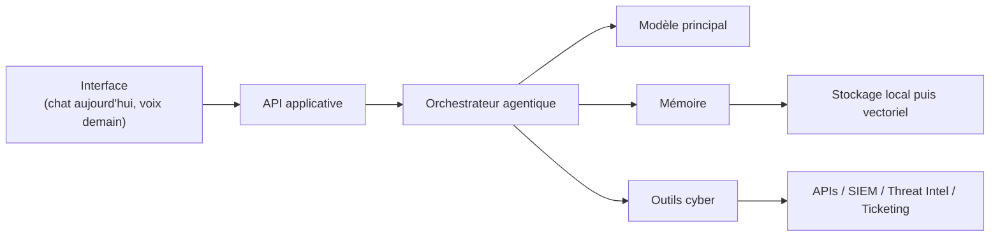

# Architecture initiale

## Vue d'ensemble

## Choix d'architecture

### 1. Un noyau applicatif Python

Python reste le meilleur compromis pour :

- intégrer rapidement des APIs cyber ;
- manipuler données, fichiers et scripts ;
- évoluer vers RAG, orchestration et automatisation.

### 2. Une API dès le départ

Même si l'interface est simple aujourd'hui, une API rend possible plus tard :

- interface web ;
- client desktop ;
- intégration vocale ;
- agents secondaires.

### 2 bis. Une UI intégrée au backend pour le MVP

Le premier écran utilisateur est servi directement par FastAPI :

- HTML, CSS et JavaScript simples ;
- aucune dépendance frontend lourde ;
- cycle d'itération très court.

Ce choix reste volontairement temporaire : si l'usage confirme le besoin, une interface dédiée pourra être séparée plus tard sans remettre en cause les endpoints existants.

### 3. Des couches séparées

| Couche | Rôle |
|---|---|
| `api` | exposer les endpoints |
| `core` | définir les contrats, prompts, règles métier |
| `services` | porter la logique réelle |
| `memory` | conserver contexte et connaissances |
| `tools` | intégrer les systèmes externes |

## Mémoire MVP

La mémoire initiale était volontairement sobre :

- un stockage local ;
- une séparation par `session_id` ;
- un historique récent injecté dans la conversation ;
- aucune vectorisation tant que le besoin n'est pas validé.

Ce choix permet de tester rapidement l'utilité réelle sans surconstruire une base RAG prématurée.

## Persistance durcie

Le stockage local est désormais consolidé dans SQLite :

- conversations ;
- documents ;
- extraits documentaires ;
- embeddings associés.

Une migration automatique reprend les anciens fichiers JSONL lorsqu'une base vide est détectée, ce qui permet d'évoluer sans rupture de données.

Les schémas plus anciens sont aussi mis à niveau en place lorsque l'authentification est introduite :

- ajout de `user_id` sur les conversations et les extraits ;
- reconstruction contrôlée de la table documentaire si elle utilisait encore une déduplication globale ;
- conservation des données historiques sous l'identité `local-dev`.

## Identité et cloisonnement

Le backend distingue maintenant :

- l'identité applicative (`users`, `auth_tokens`) ;
- le rôle (`admin`, `analyst`) ;
- le profil de travail individuel (`user_profiles`) ;
- la mémoire conversationnelle par utilisateur ;
- la base documentaire par utilisateur.

Le mode local reste volontairement permissif pour accélérer le développement, mais le modèle de données est déjà préparé pour une exécution multi-utilisateur stricte.

Le même `user_id` est maintenant propagé jusqu'au sideband Realtime, afin que les outils appelés pendant une session vocale utilisent le bon périmètre documentaire.

La première couche d'autorisation repose sur des rôles simples :

- l'administrateur peut gérer les utilisateurs ;
- l'analyste conserve l'accès aux capacités cyber quotidiennes ;
- les capacités exposées sont centralisées pour préparer des permissions d'outils plus fines ensuite.

Le contrôle d'accès est maintenant exprimé par permissions atomiques (`knowledge.read`,
`workflow.alert_triage`, `admin.audit.export`, etc.), ce qui garde les rôles simples tout en évitant
de lier les futurs outils à une logique trop grossière.

Les sessions authentifiées sont désormais séparées de la simple identité :

- seul le **haché** du jeton est conservé en base ;
- chaque session possède sa propre date d'expiration ;
- les sessions peuvent être révoquées individuellement ;
- la dernière utilisation est tracée pour préparer l'audit et la détection d'anomalies.

## Défense applicative

Le backend inclut maintenant trois protections transverses :

- un journal d'audit pour les inscriptions, connexions, blocages, déconnexions, révocations et changements de rôle ;
- un mécanisme de limitation des échecs de connexion par couple email / adresse IP ;
- des en-têtes HTTP restrictifs pour limiter le framing, le sniffing de contenu et certaines fuites côté navigateur.

La préparation MFA est volontairement séparée de l'activation effective :

- `users.mfa_required` exprime maintenant qu'un second facteur vérifié est exigé à la connexion ;
- `mfa_factors` peut accueillir plusieurs facteurs ;
- les secrets TOTP sont chiffrés avant persistance avec une clé fournie par l'environnement ;
- les codes déjà consommés sur une fenêtre TOTP sont rejetés afin d'éviter leur réutilisation immédiate.

Le flux complet ajoute désormais :

- `mfa_recovery_codes`, stockés sous forme de hachés et consommables une seule fois ;
- une génération de codes seulement lorsqu'un facteur vérifié existe déjà ;
- un audit dédié lors de la génération et de l'utilisation d'un code de récupération ;
- une désactivation de facteur soumise à une nouvelle preuve MFA ;
- une confirmation explicite pour supprimer le dernier facteur actif ;
- la révocation automatique des codes de récupération encore inutilisés lorsque MFA est volontairement désactivé.

## Connaissances MVP

La mémoire conversationnelle est désormais séparée d'une base de connaissances :

- documents JSONL ;
- extraits découpés localement ;
- recherche sémantique par embeddings lorsque disponible ;
- recherche lexicale en repli ;
- injection des extraits pertinents dans le chat.

Cette séparation est importante : les conversations racontent ce qui s'est passé, les documents décrivent ce que Jarvis sait.

## Profil de travail

Le profil utilisateur est maintenant une troisième forme de mémoire, distincte des deux autres :

- les **conversations** gardent l'historique récent ;
- les **documents** portent les références, playbooks et procédures ;
- le **profil** décrit la personne et son cadre de travail.

Le profil contient notamment la fonction, l'organisation, l'environnement, les axes prioritaires,
la langue, le style de réponse, la préférence d'approbation et le fuseau horaire.

Cette séparation évite de mélanger les préférences personnelles avec les sources documentaires, et
permet d'injecter un contexte stable dans le chat comme dans les sessions vocales Realtime.

## Méthodes de travail réutilisables

Jarvis possède maintenant deux objets complémentaires :

- les **profils de tâches**, qui décrivent la forme d'un livrable ;
- les **playbooks**, qui décrivent une procédure métier réutilisable.

Cette séparation évite de figer une procédure dans un format unique. Un playbook de triage phishing peut,
par exemple, produire un brief SOC rapide ou un compte rendu plus détaillé selon le profil associé.

Lors d'une conversation, les playbooks proches de la demande courante sont recherchés lexicalement puis
injectés dans le contexte du modèle. En Realtime, un outil serveur dédié permet au modèle de récupérer ces
méthodes à la demande, avec le même cloisonnement par utilisateur que pour les documents.

## Routines de veille

Le premier mécanisme de routine quotidienne repose sur :

- des **watchlists** persistées par utilisateur ;
- un **brief quotidien** généré à la demande ;
- l'intégration NVD déjà présente, enrichie d'une recherche sur les CVE récemment publiées.

Le choix reste volontairement simple :

- les watchlists décrivent ce qu'il faut suivre ;
- la NVD fournit la source structurée ;
- le brief regroupe les nouveautés utiles sans introduire encore de planificateur ni de connecteur tiers.

Cette approche livre déjà une valeur récurrente tout en gardant ouverte l'évolution vers des automatisations
planifiées et des sources additionnelles.

## Automatisations natives

Le moteur d'automatisations est désormais séparé en deux responsabilités :

- les **définitions** (`automations`) ;
- les **exécutions** (`automation_runs`).

Cette séparation garde les routines traçables et extensibles. La première implémentation supporte :

- une tâche `daily_brief` ;
- un horaire quotidien avec fuseau explicite ;
- une exécution manuelle ;
- une exécution des routines échues ;
- un historique de statut ;
- un mode `requires_approval` pour réserver l'exécution effective jusqu'à validation humaine.

Le planificateur permanent n'est pas encore lancé en arrière-plan : le moteur métier existe d'abord comme
socle stable, puis un scheduler pourra l'appeler sans mélanger calcul d'échéance, persistance et exécution.

## Scheduler

Le scheduler de fond est maintenant accroché au cycle de vie FastAPI :

- démarrage via le lifespan de l'application ;
- tâche asynchrone conservée explicitement ;
- boucle périodique configurable ;
- arrêt propre à la fermeture ;
- exécution des routines dues pour chaque utilisateur connu.

Le scheduler reste volontairement simple : il ne remplace pas encore une file de jobs distribuée, mais il
transforme déjà le moteur en comportement autonome réel dans une instance applicative unique.

## Inbox interne

Les résultats produits dans le temps ne sont plus seulement stockés dans des tables techniques :

- `automation_runs` garde la vérité d'exécution ;
- `inbox_items` fournit une projection orientée utilisateur.

Cette séparation permet d'afficher les livrables, les échecs et les demandes d'approbation sans mélanger
l'audit machine avec la communication utile pour l'analyste.

Le chat reçoit maintenant un résumé léger de l'inbox non lue, tandis que le mode Realtime dispose d'un
outil `list_inbox`. Cette séparation évite d'injecter trop de contenu à chaque réponse tout en laissant le
modèle récupérer le détail à la demande.

## Connecteurs externes

Le premier cadre de connecteurs suit trois principes :

- lecture seule ;
- séparation par fournisseur ;
- résolution progressive des secrets via environnement puis coffre local chiffré.

Les adaptateurs initiaux couvrent :

- GitHub ;
- Google Drive ;
- Jira.

Ils sont volontairement minces : leur rôle est d'exposer des objets normalisés au reste de Jarvis, sans
confondre l'accès fournisseur avec la logique d'assistance ou d'automatisation.

Les jetons fournisseurs peuvent maintenant être stockés dans `secret_vault_entries`, chiffrés avec une clé
applicative fournie par l'environnement. Le mode par variables d'environnement reste prioritaire, ce qui
permet de garder les déploiements simples tout en ouvrant une migration vers un stockage persistant contrôlé.

Ces adaptateurs sont maintenant réutilisés dans :

- le mode Realtime, sous forme d'outils à la demande ;
- les routines, via un digest externe planifiable ;
- le chat textuel, qui peut lancer un cycle de function calling en lecture seule lorsqu'une réponse
  dépend d'un état externe récent.

## Garde-fous d'outils

Les outils agentiques passent désormais par une couche de politique dédiée, distincte des permissions HTTP :

- les permissions expriment **qui** peut accéder à une capacité ;
- les garde-fous expriment **si Jarvis doit exécuter maintenant**, demander une approbation ou seulement suggérer.

Chaque outil porte :

- une permission attendue ;
- un niveau de risque ;
- un mode d'accès (`internal_read`, `external_read`, `analysis`).

La décision tient aussi compte de la préférence utilisateur d'approbation et produit un événement d'audit
minimal (`tool.allow`, `tool.approval_required`, `tool.blocked`) sans persister les arguments sensibles eux-mêmes.

Le système dispose désormais d'une vraie séparation entre **proposition** et **exécution** :

- les actions sensibles peuvent créer une entrée `tool_approval_requests` ;
- la demande est visible côté utilisateur dans une file d'approbations dédiée ;
- l'exécution réelle ne se produit qu'après une validation explicite ;
- les états `pending`, `executed`, `rejected` et `failed` rendent le cycle traçable ;
- les décisions importantes sont aussi reflétées dans l'inbox et l'audit.

Le premier outil d'écriture branché sur ce flux est `create_watchlist`. C'est volontairement une action
interne et réversible : assez concrète pour valider le modèle d'approbation, sans introduire trop tôt une
écriture externe vers un système tiers.

## Workflows MVP

Le premier niveau d'intelligence métier est exposé via des workflows dédiés :

- résumé de CVE ;
- triage d'alerte ;
- investigation guidée d'alerte ;
- brouillon de rapport d'incident.

Chaque workflow possède :

- son propre contrat d'entrée ;
- son propre prompt métier ;
- un endpoint stable ;
- une réponse libre aujourd'hui, destinée à devenir structurée ensuite.

L'investigation guidée marque une étape différente : elle orchestre plusieurs briques déjà existantes dans
un même flux métier. Elle combine le triage, la mémoire documentaire, les playbooks personnels et, lorsque
c'est pertinent, la proposition d'une action soumise à approbation humaine. Elle peut aussi inclure un
contexte externe **contrôlé** : dépôts GitHub récents, fichiers Drive ciblés et tickets Jira retournés à
partir d'indices explicites fournis dans la demande, plutôt que d'inventer seule des requêtes incertaines.

## Intégrations MVP

La première intégration externe est la NVD :

- récupération d'un enregistrement par identifiant CVE ;
- normalisation minimale des champs utiles ;
- transmission de ces données au workflow de synthèse.

Cette séparation entre **intégration** et **analyse** évite de mélanger l'accès aux données avec le raisonnement du modèle.

## Évolution prévue

### Phase 1 — Copilote personnel

- chat ;
- mémoire locale ;
- rédaction et synthèse ;
- spécialisation cyber.

### Phase 2 — Collègue outillé

- ingestion de documents ;
- connecteurs cyber ;
- workflows d'investigation ;
- dashboard.

### Phase 3 — Jarvis avancé

- voix temps réel ;
- agents spécialisés ;
- rappels, monitoring, automatisations approuvées.

## Sécurité dès le départ

- secrets uniquement via variables d'environnement ;
- authentification activable par configuration ;
- isolation des conversations et des documents par utilisateur ;
- permissions explicites par outil ;
- journalisation des actions ;
- aucune action destructive automatique ;
- séparation entre recommandation et exécution.

## Observabilité minimale

Le backend expose maintenant :

- un healthcheck enrichi ;
- une journalisation HTTP simple avec durée, méthode, chemin et statut.
